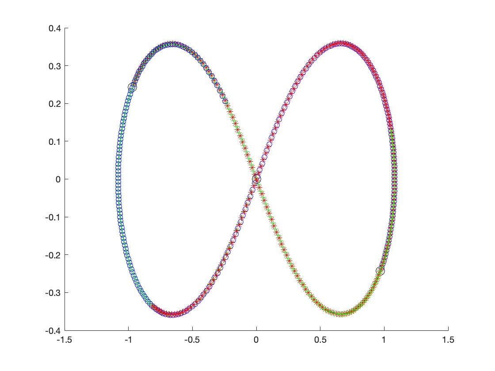

# Three-Body Problem
## Introduction
Modeling gravitational forces and movement of 3 bodies.
It's tougher than you might think! The 3BP can't really be definitely "solved" using a set number of equations/operations (no closed-form solution). 
The best one can really do is using power series (under certain initial conditions, mainly that angular velocity = 0, meaning we have no triple collisions). However, such a solution (Sundman's) is kind of useless; we don't get meaningful estimates until about 108000000 terms!

BUT! 
We can still have fun with the 3BP with some cool very-special case solutions. One of the first ones I came across was the "figure 8 solution," which was discovered and proved around 20-30 years ago. 

Funky! There's tons of other cool solutions out there, resulting in polar flowers, cardioids, circles, and weirdly chaotic figure 8's. How do we know this? Because Henri Poincaré proved there's an infinte number 🙃

While I obviously can't find and model them *all*, I hope to model a few nifty ones!

## The Math
*Coming soon!*

